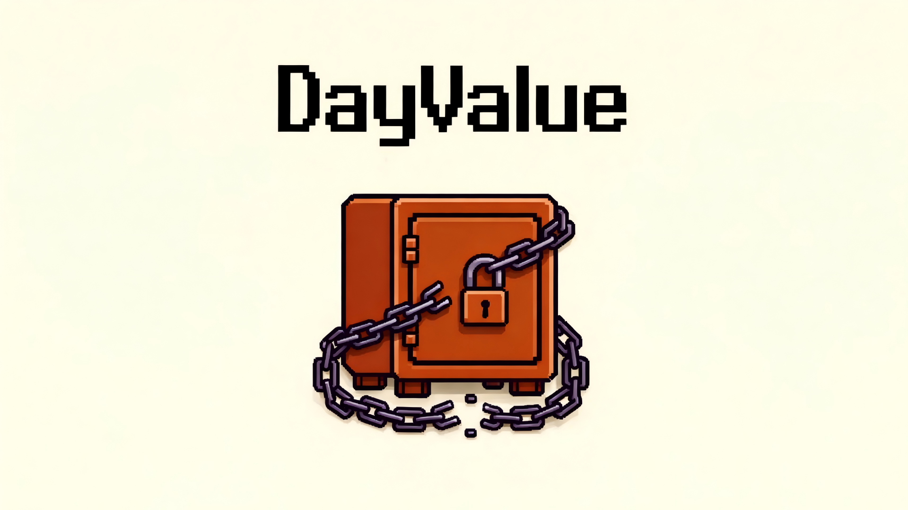
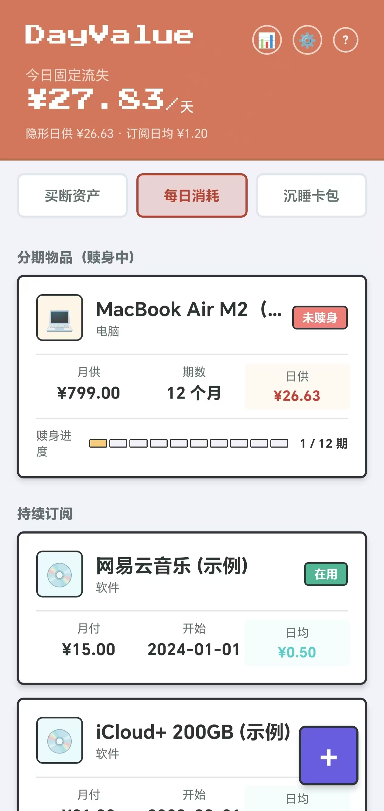
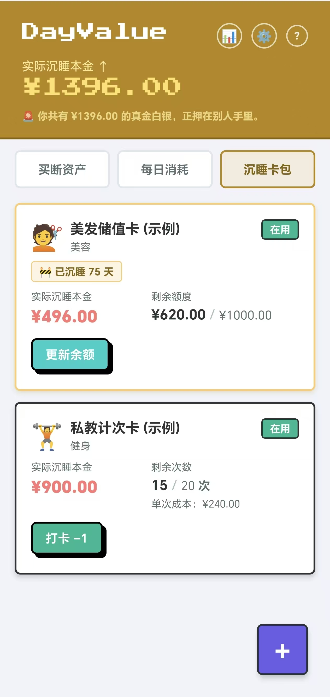
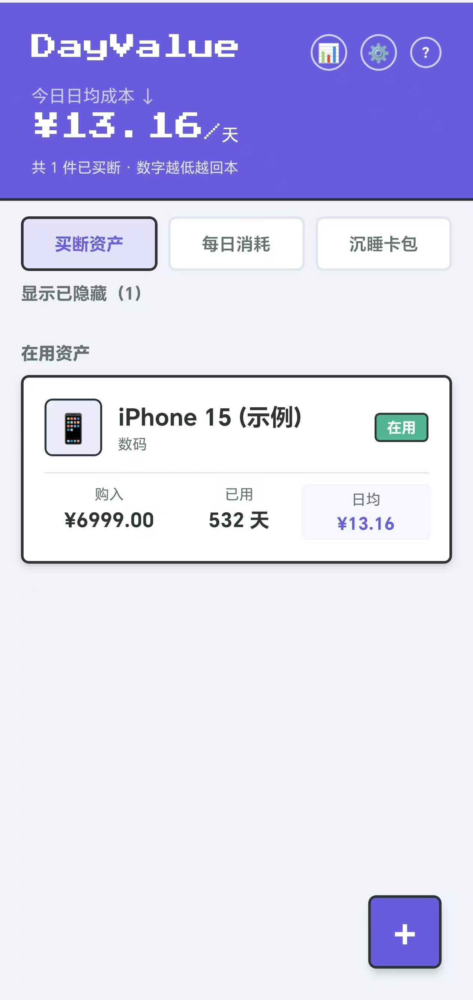

  

# 👾 DayValue：长期主义！守卫你的小金库

> “有想过你每天的固定开销吗？可不只包括眼前的吃喝哦。在这个鼓吹分期、消费主义盛行的时代，DayValue 帮你量化隐形开销，看清真实的代价。”

DayValue 是一款采用像素风（Pixel Art）与新粗野主义（Neobrutalism）设计的本地化消费反思工具。我们不记录你今天买了一杯什么奶茶，我们只关心你买的那些大件、背上的分期、以及冲动充值的会员卡，到底在怎样影响你的生活。

很多支付陷阱用“免息”、“低月供”或“充500送200”来掩盖极高的真实代价。DayValue 的诞生，就是为了撕下这些伪装，把你被蒙蔽的现金流一笔笔算清楚。

## 📸 产品截图

  
  
  

## 💡 我们能帮你做什么？

1. 计算买断贵重物品的性价比（日均成本）
   - **功能**：录入你全款买下的大件物品（如手机、电脑、外设）及残值。DayValue 会根据购买日期，每天自动计算并更新它的“日均成本”。
   - **理念**：好东西的价值在于“使用”而非“拥有”。看着几千块的设备，随着使用天数的增加，每天的摊销成本降到几块甚至几毛钱，你能获得极其舒适的正向情绪反馈。买得贵没关系，用得久、用回本才是赢家。

2. 扒开分期与订阅的“每日影子开销”
   - **功能**：录入你的分期付款和各类吃灰的包月/包年订阅。DayValue 会把它们统统打碎，算出一个血淋淋的“今日固定流失”总额。对于分期物品，内置算法会暴露出分期溢价，并利用牛顿迭代法算出它背后的真实年化利率 (IRR)。
   - **理念**：商家喜欢用“低月供”、“免息”来麻痹你。我们将它还原成你每天一睁眼就要强制付出的生存底线成本。并且，分期的物品在还清之前，会被死死钉在这个“流血”轨道里，只有当你结清欠款点击“赎身”，它才能跃迁到计算日均成本的正向循环中。

3. 监控“无息贷款”式的储值陷阱
   - **功能**：针对理发店、洗车店、咖啡店的充值卡或计次卡，你只需录入“实际支付本金”与“总面值/总次数”。每次消费后简单扣减，DayValue 会自动剥离虚假的赠金，算出你真实被套牢的**“沉淀本金”**。如果卡片太久没用，App 会在首页发出沉睡预警。
   - **理念**：充 500 送 200 听起来很赚，但只要本金没花完，你就是在给商家放无息贷款，并随时承担他们跑路的风险。这个模块不记复杂的流水，只为了做一件事：时刻提醒你去把压在别人手里的真金白银花掉。

## 🛡️ 绝对离线与拒绝 API

市面上的记账软件都在内卷“一键导入支付宝/微信账单”、“自动同步购物平台订单”。但 DayValue 偏偏选择做一款**“笨拙”**的 App。

- **🚫 拒绝购物 API**：自动导入只会让人对花钱变得麻木。DayValue 希望你手动敲下分期的首付、月供和储值的本金。这短短几秒钟的手动录入，是我们为你设计的**“财务冷静期”**。只有亲手输入，你才能感受到花钱的痛楚。
- **🔌 绝对离线**：DayValue 没有云端服务器，没有账号注册，不请求任何网络权限。你的每一笔负债、每一分被套牢的死钱，都通过 SQLite 死死地锁在你的手机本地硬盘里。没有数据挖掘，没有用户画像，**你的财务隐私，只有你自己知道**。

## 🛠 关于项目

本项目采用 **Vibe Coding**（AI 辅助编程）方式开发。

- **纯粹与安全**：完全本地化（基于 SQLite），无任何云端上传，你的财务隐私只留在你的手机里。

欢迎大家下载体验、Fork 代码。如果你有任何对产品迭代有建议，非常欢迎提交 Issue或直接通过下方邮件与我联系！

联系方式：1792480506@qq.com

## 🛡️ 安全与隐私声明

**代码审计**：本项目已开启 GitHub CodeQL 静态安全分析。每一行进入主分支的代码都经过工业级漏洞扫描，确保无恶意逻辑、无注入风险。

**透明构建**：Release 页面提供的 APK 是通过 GitHub Actions 自动化生成的，确保安装包与你看到的源码完全一致，杜绝"本地加料"。

**绝对离线**：本应用**不申请网络权限**（`android.permission.INTERNET`）。这意味着即便有病毒，它也无法将数据传出你的手机。
